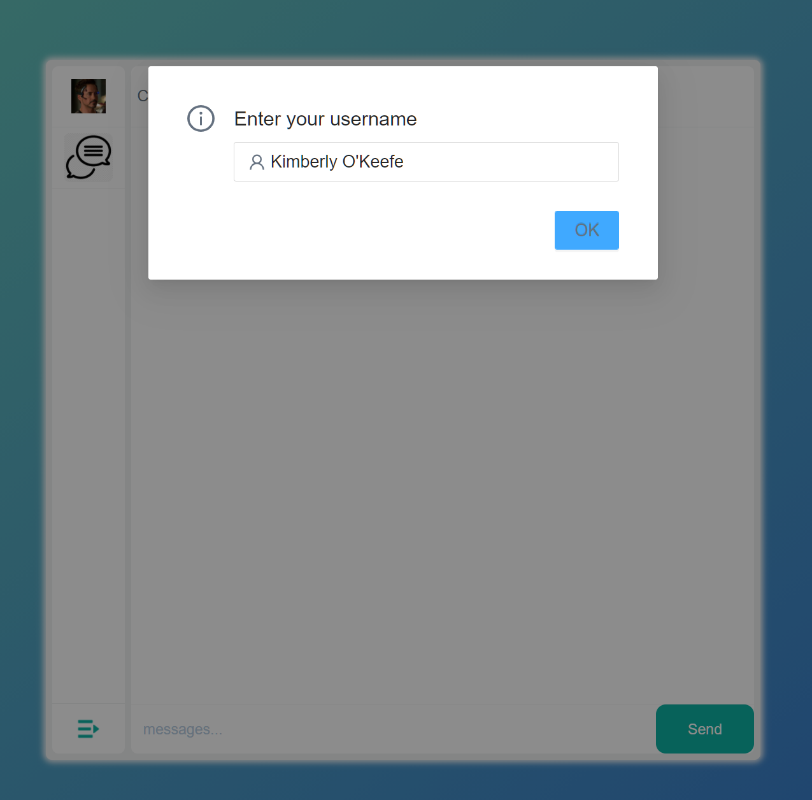
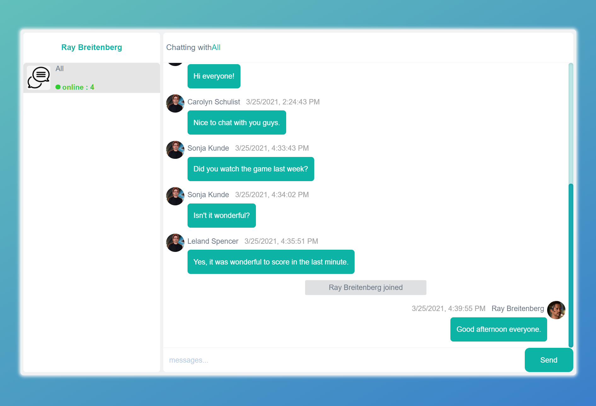
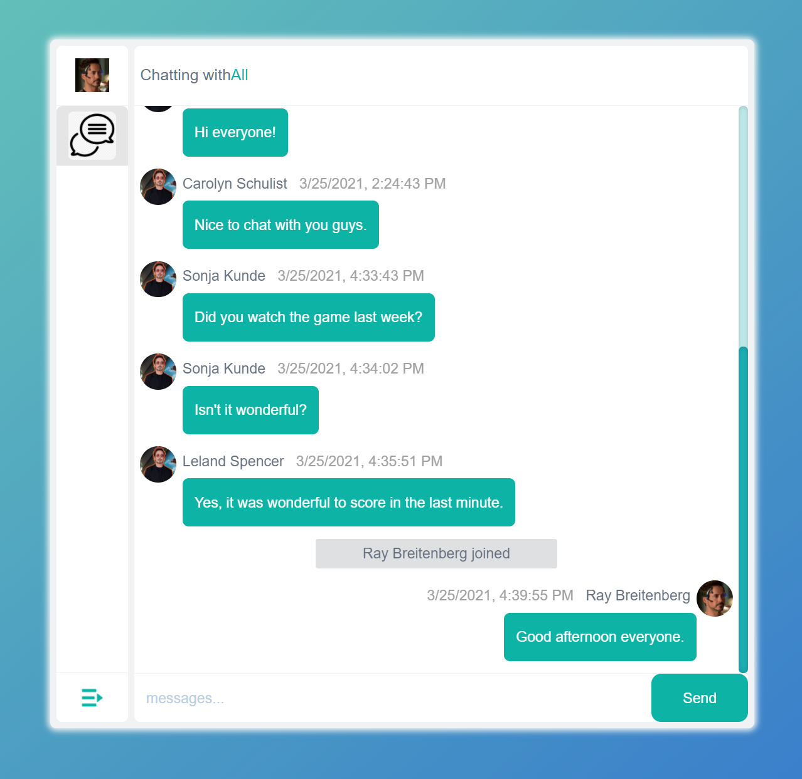
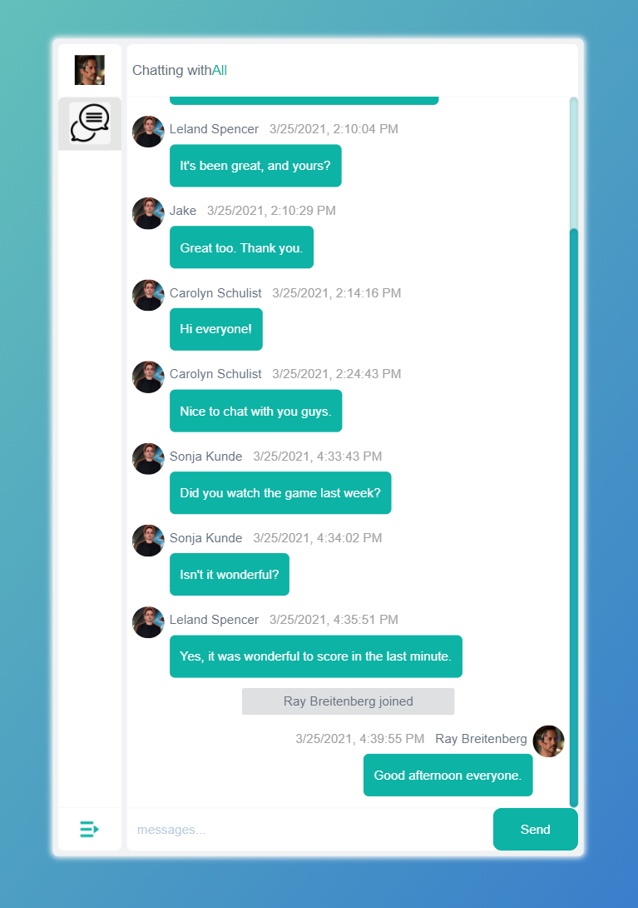
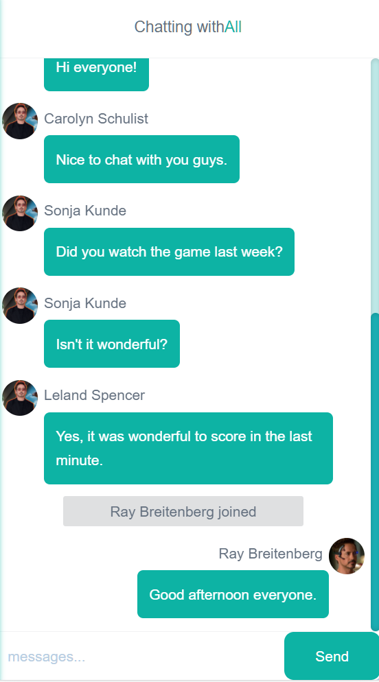

# Two Days' Challenge of AutoDelegate.

## Group chat web application


### Short Description

> This is a  full stack responsive web application, built by **Typescript, React and Node**.   


### Features

- Real-time multi-person online chat.
- User join and leave reminders.
- Responsive web design, different interfaces style for different devices.
- User chat data is persistently stored in a centralized database.
- Automatically loads historical messages when a new page is opened.
- Usernames are automatically provided by Faker and custom usernames are supported.
-  Include unit tests
- Support  local time display.


### Stack

+ Language: [Typescript](https://www.typescriptlang.org/)

- Back End Framework: [Express](https://expressjs.com/)
- Front End Framework: [React](https://reactjs.org/)
- Database: [MongoDB](https://www.mongodb.com/) & [Mongoose ODM](https://mongoosejs.com/)
- Real-Time Engine: [Socket.IO](https://www.npmjs.com/package/socket.io) & [Socket.IO-Client](https://www.npmjs.com/package/socket.io-client) 
- UI Components:  [Ant Design](https://ant.design/components/overview/)
- Styling: [styled-components](https://styled-components.com/) & [SASS](https://sass-lang.com/)
- Code Formatting: [Prettier](https://prettier.io/)
- Unit Test: [Mocha](https://mochajs.org/)


### Install & Run

1. **Install the dependencies**

   ```js
   > cd ./frontend/
   > yarn
   
   > cd ./backend/
   > yarn
   ```

2. **Run**

   ```js
   >cd ./backend/
   >npm run all
   ```

   

## Unit Test

1. Go to Folder

   ```js
   > cd ./frontend/
   ```

2. Register Test

   ```js
   > npm run test
   ```

3. Login Test

   ```js
   > npm run test2
   ```

   


## Database Model

> MongoDB:  ' mongodb://127.0.0.1:27017/'
>
> Database Name :  chat


+ Records

  + ```js
    type RecordModel = {
    	user_id: string
    	user_name: string
    	room_name: string
    	chat_content: string
    	status: number
    }
    ```

+ Rooms

  + ```js
    type RoomModel = {
    	user_id: string
    	user_name: string
    	room_name: string
    	status: number
    	num: number
    	badge_number: number
    	current_status: boolean
    }
    ```

+ Users

  + ```js
     UserModel = {
      	user_name: string
      	current_room_id: string
      	socket_id: string
    }
    ```


## Socket  Action List

+ ```js
  connection      // socket connection
  join            // join the chatroom
  login           // user login
  chat_reg        // user registeration
  get_room_list   // room list
  off_line        // user offline
  chat_message    // process chat message
  ```

+ ```js
  io.on('connection',(socket)=>{
  io.on('login',userId)
      1.update user's socket_id
  io.on('chat_reg', username)
      1. new User(), save user
      2.emit chat_reg   return UserInfo
      3.new Room() , save room
      4.emit get_room_list, send roomlist to new user
  io.on('get_room_list', userId)  
      1.send RoomModal to user
  io.on('join',data)
      1. find userData 
      2. update user's current_room_id
      3. update other rooms of the same user's current_status to false
      4. update selected room status to true
      5. Find records(chat messages)
      6. emit chat_message
      7. Find how many users are in same room_name & status:true
      8. update Room's num(online numbers) to users' number
      9. emit room_list_all  return all rooms to user, it will be processed by userId
      10. emit chat_message, add "username joined"
  io.on('offline',data) 
      1.update User's current_room_id to ''
      2.update Room,set user's current_status of all rooms to false
      3. current room's users number -1
      4. emit chat_message,  "user left"
      5.socket.leave(data.roomName)
  io.on('chat_message',messageData)
      1. if GroupChat, update offline users' badge number  
      2. update room_list
      3. create message to database
     
      1. if private room
      2. find user, (username === room name), get userId
      3. Find user's room
      4. room
          ? (
          1.update offline user(userId) badge number 
          2. update room_list
          3.insert a message to database
      	4. emit  Room's latest chat message
            ) 
          :(
          1.new Room, save room
          2.update room_list
          3.insert a message to database
          4. emit new Room's latest chat message
          )
  })
  ```

+ 

## Screen-shots

### 1.Enter the username

+ 

### 2.Responsive Interface

+ **Full Size**
  + 


+ **Medium Size**
  + 

+ **iPad Size**
  + 

+ **Mobile Size**
  + 


